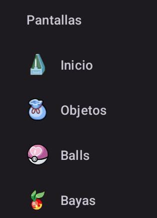

# 📱 Calculadora PokeMMO v1.0
**¡Domina el mercado de GTL!** Optimiza tus costos de producción y maximiza tus ganancias de farmeo con esta herramienta especializada.

  

---

## ✨ Características principales
Esta no es una calculadora común, está diseñada para algunos métodos de farmeo de PokeMMO:

* **📱 Interfaz Intuitiva:** Diseñada específicamente para jugadores de PokeMMO.
* **🍓 Conteo de Semillas Zanama:** Calcula exactamente cuántas semillas necesitas y cuánto ganarás con tus cosechas.
* **⚾ Costos de Fabricación de Balls:** Calcula el precio real de producir tus propias Poke Balls y detecta si es más rentable fabricarlas o comprarlas.
* **💰 Gestión de Precios de Objetos:** Herramienta rápida para calcular márgenes de beneficio en el GTL.
* **⚡ Interfaz Ligera en Kotlin:** Diseñada para abrirse al instante mientras juegas en tu dispositivo Android.

---

## 📸 Un vistazo a la App
| ¡Módulos totalmente funcionales!|
| :---: |
|  |

---

## 🚀 Cómo instalar
1. **Descarga:** Ve a la sección de [Releases](https://github.com/LAPLANTA10S/CalculadoraPokeMMO/releases/tag/v1.0) y descarga el archivo `.apk`.
2. **Instala:** Abre el archivo en tu dispositivo Android.
3. **Calcula:** ¡Empieza a administrar tus PokeYenes!

## 🛠️ Tecnologías utilizadas
* **Lenguaje:** Kotlin.
* **Entorno:** Android Studio / Gradle.

---

## 🤝 Créditos y Contribuciones
Proyecto desarrollado por **LAPLANTA10S**. 
*¿Tienes sugerencias para nuevas funcionalidades?* ¡Abre un [Issue](https://github.com/LAPLANTA10S/CalculadoraPokeMMO/issues) y ayúdanos a mejorar!

---

  Hecho con ❤️ para la comunidad de PokeMMO 🌱✨

